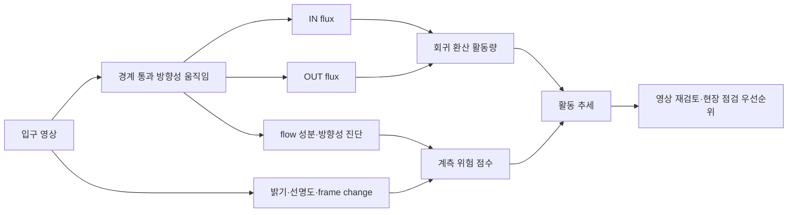
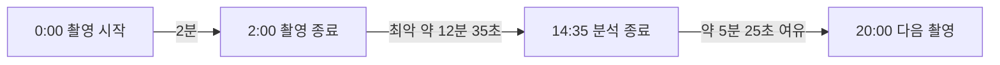
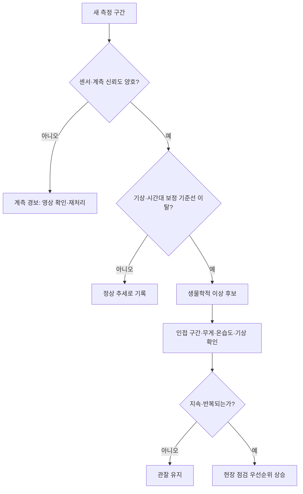

# 양봉 전문가를 위한 영상 기반 벌통 활동·계측 신뢰도 모니터링 보고서

## 현장 해석, 벤치마크, 운용 형태 및 검증 과제

**보고서 기준일:** 2026-09-06  
**대상 독자:** 양봉 연구자, 양봉가, 현장 시험 설계자  
**시스템의 현재 정의:** 벌통 입구의 방향성 움직임을 연속 측정하고, 계측값을 신뢰하기 어려운 구간을 함께 표시하는 비접촉식 연구용 모니터링 프로토타입

> **현장 요약**  
> 이 시스템은 벌통 건강을 자동 진단하거나 봉군의 벌 수를 세는 장치가 아니다. 현재 가장 타당한 역할은 `IN`, `OUT`, 총 입구 활동의 시간적 변화를 기록하고, 영상 조건 때문에 큰 과소계측이 의심되는 구간을 표시하여 **어느 벌통과 어느 영상을 먼저 확인할지 정하는 것**이다. 중·고활동 구간의 상대 변화 관찰에는 가능성이 확인됐지만, 저활동 정밀 계수, 새 장치 일반화, 질병·농약 피해·분봉 등의 원인 판별은 아직 검증되지 않았다.

---

## 1. 무엇을 측정하는 시스템인가

카메라는 벌통 입구의 사각형 경계 주변에서 optical flow를 계산한다. 움직임을 네 경계의 법선 방향으로 투영한 뒤, 입구 안쪽을 향하는 성분과 바깥쪽을 향하는 성분을 각각 `IN`과 `OUT` flux로 누적한다. 사람이나 개체 검출 모델처럼 벌마다 ID를 부여하지 않는다.



### 1.1 지표의 안전한 해석

| 출력 | 현장에서 해석할 수 있는 의미 | 직접 의미하지 않는 것 |
|---|---|---|
| `IN` | 입구 안쪽 방향의 통행·비행 움직임 | 화분·꿀을 가지고 귀환한 일벌만의 수 |
| `OUT` | 입구 바깥쪽 방향의 통행·비행 움직임 | 채집을 떠난 일벌만의 수 |
| `IN + OUT` | 해당 구간의 총 입구 활동 강도 | 봉군 세력 또는 벌통 내부 개체 수 |
| `IN - OUT` | 짧은 구간에서의 방향 비대칭 | 봉군 개체 수의 순증감 또는 순수 채밀량 |
| 위험 점수 | 큰 **과소계측**일 가능성이 높은 영상 조건 | 질병·폐사·농약 피해가 발생할 확률 |

현재 가장 안정적으로 해석할 수 있는 값은 같은 벌통·같은 설치 조건에서 반복 측정한 `IN + OUT`의 상대 변화다. `IN - OUT`은 외역봉의 출발과 귀환 사이 시간차, 관측 구간 길이, 표류, 체공 및 반복 통과에 영향을 받으므로 장기적인 봉군 증감으로 곧바로 해석하면 안 된다.

### 1.2 영상 신호에 함께 들어갈 수 있는 행동

측정 대상은 우선 “실제 출입 벌”이 아니라 “입구 경계의 방향성 움직임”이다. 다음 행동이 실제 출입과 함께 flux에 포함되거나 오류를 만들 수 있다.

- 정위비행과 입구 앞 체공
- 소문 앞 방향 전환과 반복 왕복
- 경계·환기 행동 및 앞판 보행
- 입구 혼잡, 벌의 겹침과 일시적 가림
- 도봉, 수벌 출입, 죽은 벌 반출
- 벌통 앞 군집, 포식자 또는 다른 곤충의 움직임
- 바람에 움직이는 물체, 그림자, 카메라 진동

따라서 향후 고오차 영상을 양봉 행동별로 판독하는 작업은 단순 오류 수정뿐 아니라, 어떤 생물학적 행동을 영상으로 구분할 수 있는지 결정하는 핵심 연구가 된다.

---

## 2. 벤치마크를 양봉 현장 언어로 읽기

본 프로젝트에는 서로 목적이 다른 세 종류의 벤치마크가 있다.

1. **계측 타당성:** optical-flow flux가 수작업 출입 수와 어느 정도 연결되는가
2. **계측 신뢰도:** 큰 과소계측이 발생한 영상을 사전에 골라낼 수 있는가
3. **현장 계산 성능:** 저전력 장치가 다음 촬영 전에 분석을 끝낼 수 있는가

이 수치들은 서로 대체할 수 없다. 예를 들어 높은 위험 모델 AUC는 벌 수를 정확히 센다는 뜻이 아니며, Raspberry Pi의 처리율은 생물학적 정확도를 뜻하지 않는다.

### 2.1 Flux와 수작업 계수의 관계

현재 작업공간의 최신 회귀 산출물은 수작업 참값이 0인 방향을 제외하고 선형 환산식을 적합했다.

| 방향 | 전체 행 | 적합에 사용한 행 | R² | MAE | RMSE | 선형식 |
|---|---:|---:|---:|---:|---:|---|
| IN | 3,822 | 2,455 | 0.718 | 17.38 | 26.61 | `8.057e-6 × flux + 13.534` |
| OUT | 3,822 | 2,442 | 0.691 | 18.87 | 28.22 | `7.785e-6 × flux + 13.869` |

이는 동일 자료에 적합하고 동일 자료에서 계산한 **내부 적합도**이며, 완전히 새로운 양봉장에 대한 독립 시험 성능이 아니다. flat-exponential 모델은 R²와 RMSE가 근소하게 좋았지만 MAE가 약간 나빴고, 차이가 매우 작아 현재 자료로 실질적인 비선형 우위를 주장하기 어렵다.

양의 절편은 매우 낮은 활동에서 중요한 문제를 만든다. 참값이 0보다 큰 2,522개 영상에서 절대상대오차의 중앙값은 42.8%였지만, 극단적 상대오차 집단 282건 중 96.1%는 실제 총출입이 1~3이었다. 이 집단은 실제값 중앙값 2에 대해 예측 중앙값 28이었으며 모두 과대계측이었다.


현장적 의미는 명확하다. 현재 환산값은 **무활동과 극저활동을 정밀하게 구분하는 카운터로 사용하면 안 된다.** 저활동 상태를 먼저 판별하고, 활동이 확인된 경우에만 수량을 회귀하는 2단계 모델이 필요하다.

### 2.2 활동이 충분한 구간의 정확도

실제 총출입이 50 이상인 1,384개 영상만 보면 다음과 같다.

| 지표 | 결과 |
|---|---:|
| 절대상대오차 중앙값 | 23.7% |
| 절대상대오차 90백분위 | 69.8% |
| 과소계측 | 820건, 59.2% |
| 과대계측 | 564건, 40.8% |
| 고오차 과소계측 | 142건, 10.3% |
| 고오차 과대계측 | 89건, 6.4% |

고오차 과소계측 집단의 실제값 중앙값은 136이었지만 예측 중앙값은 30.3이었다. 고오차 과대계측 집단은 실제값 중앙값 84에 대해 예측 중앙값 161.1이었다. 따라서 시스템은 큰 활동 흐름을 포착할 수 있지만 일부 2분 구간에서는 활발한 출입을 크게 놓치거나, 반복·양방향 움직임을 실제 통행보다 많이 셀 수 있다.


이 자료만으로 서로 다른 벌통의 절대 활동량을 바로 서열화하는 것은 이르다. 우선은 각 벌통이 자신의 같은 시간대·유사 기상 기준선에서 얼마나 벗어났는지를 보는 것이 안전하다.

### 2.3 큰 과소계측을 미리 표시하는 신뢰도 모델

실제 총출입이 50 이상인 1,384개 영상 가운데 예측이 실제보다 56.2%를 초과해 낮은 142건을 “고오차 과소계측”으로 정의했다. 56.2%는 양봉학적 허용 기준이 아니라 이 자료의 오차 군집에서 유도된 경계다. 장치 번호를 제외하고 영상 품질 및 flow 진단 feature를 사용한 권장 모델의 결과는 다음과 같다.

| 검증 방식 | ROC AUC | Average precision | 해석 |
|---|---:|---:|---|
| 날짜 그룹 5-fold 교차검증 | 0.984 | 0.854 | 기존 장치군의 다른 날짜에서 유망 |
| 시간상 마지막 20% 날짜 보류 | 0.971 | 0.918 | 미래 시점 보류에서도 유망 |
| 장치 하나 전체 제외 | 0.835 | 0.420 | 보지 못한 새 장치에서는 성능 저하 |

날짜 그룹 교차검증에서 선택한 임계값 0.444를 적용하면 정밀도 75.2%, 재현율 81.0%, 특이도 96.9%, F1 0.780이었고 전체 영상의 11.1%를 재검토 대상으로 표시했다.


이 모델은 count를 자동으로 보정하는 모델이 아니다. 또한 개별 feature의 계수는 상관관계가 강하므로 밝기나 frame difference 하나를 원인으로 단정해서는 안 된다. 가장 적절한 용도는 “이 영상의 계수값은 크게 낮게 나왔을 수 있으니 원본을 보라”는 **계측 품질 경보**다. 또한 이 성능은 참값 50 이상임을 사후에 아는 영상 안에서만 계산됐다. 현장에서는 관측 가능한 값으로 적용 대상을 정한 뒤 전체 스트림에서 다시 검증해야 한다.

### 2.4 장치별 실패가 서로 다른 사례

장치 16과 20은 모두 과대계측 문제가 있었지만 원인은 동일하지 않았다.

| 구분 | 장치 16 | 장치 20 |
|---|---:|---:|
| 고오차 과대계측 | 47/163, 28.8% | 19/245, 7.8% |
| 실제값 중앙값 | 80 | 97 |
| 예측값 중앙값 | 154 | 167.3 |
| 절편 제거 후 남은 사례 | 23/47 | 6/19 |
| 장치별 날짜-CV 보정 효과 | MAE 43.48 → 20.58 | MAE 54.08 → 56.14 |

장치 16은 반복적·양방향 경계 움직임과 장치별 calibration 불일치가 함께 의심되며, 장치별 보정으로 고오차 사례가 47건에서 12건으로 줄었다. 장치 20은 저활동 edge hour의 비중과 양의 절편 영향이 컸고, 장치별 보정은 거의 도움이 되지 않았다. 두 해석 모두 통계적 진단이며, 실제 정위비행·체공·입구 혼잡·그림자 여부는 원본 영상 판독으로 확인해야 한다.


이 사례는 장치 번호만으로 하나의 보정식을 적용하기보다, **저활동 상태, 영상 품질, 행동 유형, 설치 조건을 분리해 처리해야 함**을 보여준다.

---

## 3. 현장 장치로 운용할 수 있는가

Raspberry Pi 벤치마크는 1640×1232, 24 FPS, 120초 H.264 영상 3개를 대상으로 실제 ROI 1180×260을 처리했다. 영상별 초·중·후 구간과 offline/realtime 모사를 합쳐 18회, warm-up 제외 5,291개 frame pair를 측정했다.

| 항목 | Offline | Realtime 모사 |
|---|---:|---:|
| 처리율 | 3.853 FPS | 3.398 FPS |
| End-to-end 평균 | 259.46 ms | 331.21 ms |
| End-to-end p95 | 270.64 ms | 381.29 ms |
| 24 FPS deadline miss | 100% | 100% |
| frame drop | 0% | 85.69% |

현재 dense Farneback 설정으로 24 FPS 연속 실시간 처리는 불가능하다. Offline 평균 처리 시간의 84.93%가 optical-flow 계산이었고, 단순 decode 최적화만으로는 해결되지 않는다.


다만 **2분 촬영 → 분석 → 다음 촬영**을 20분마다 반복하는 배치 운용은 동일한 실내 비스로틀링 조건에서 계산상 가능하다.



- 평균 분석 시간: 약 12분 27초
- 최악 분석 시간: 약 12분 35초
- 최악 기준 주기 여유: 약 5분 25초
- 최대 촬영 횟수: 하루 72회
- 예상 원본 영상량: 약 3.2~10.8 GB/일
- 실내 최대 SoC 온도: 44.3°C, 최소 관측 주파수 1.8 GHz

이 방식은 20분 중 2분만 보는 10% duty-cycle 표본이다. 따라서 하루 전체 출입 총계가 아니라 주기적 활동 표본으로 해석해야 하며, 관측하지 않은 18분에 단순 외삽하려면 별도 검증이 필요하다. 이 결과는 야외 밀폐 함체에서의 열 안정성을 보장하지 않는다. 현장 시험에서는 모든 주기의 분석 시간이 18분 미만이고 backlog가 0이며 thermal·undervoltage throttling 기록이 0인지 확인해야 한다.

---

## 4. 권장 현장 화면과 경보 체계

활동 이상과 계측 이상은 한 경보로 합치면 안 된다. 카메라가 흐려 낮게 나온 값을 봉군 활동 저하로 오인하면 시스템에 대한 신뢰가 빠르게 무너진다.



권장 화면은 다음 네 층을 분리한다.

1. **센서 상태:** 렌즈 오염, 카메라 이동, ROI 이탈, 가림, 조도
2. **활동 관측:** IN, OUT, 총활동 및 벌통별 기준선 대비 변화
3. **계측 신뢰도:** 정상, 주의, 원본 재검토 필요
4. **현장 판단 보조:** 기상·무게·내부 온습도와 함께 본 점검 우선순위

예시는 다음과 같다.

```text
총 입구 활동          같은 벌통·같은 시간대의 31백분위
유입 / 유출           42 / 55
최근 기준선 대비       -38%
계측 신뢰도           높음
센서 상태             정상
권장 조치             다음 2개 구간까지 관찰; 감소 지속 시 점검 후보
```

### 4.1 관측 패턴별 점검표

| 관측 패턴 | 가능한 설명 | 먼저 확인할 자료 | 시스템 조치 |
|---|---|---|---|
| 갑작스러운 총활동 감소 | 저온·강우·강풍·먹이원 변화·봉군 문제·카메라 이상 | 기상, 영상 품질, 인접 구간, 벌통 무게 | 계측 경보를 먼저 배제한 뒤 지속 시 점검 |
| 평소보다 높은 OUT | 정상 채집 출발, 정위비행, 교란·도봉 가능성 | 시간대, IN의 지연 회복, 원본 영상 | 단일 구간으로 원인 확정 금지 |
| 평소보다 높은 IN | 채집 귀환 집중, 기상 악화 전 귀소, 방향 보정 오류 | 기상 변화, ROI 방향, 다음 구간 | 방향 설정 검증 후 추세 관찰 |
| IN·OUT 모두 비정상적으로 높음 | 활발한 출입, 입구 혼잡, 반복 왕복·체공 | 원본 영상, component·bidirectional 지표 | 과대계측 후보로 영상 보존 |
| 저활동인데 예측 count가 높음 | 양의 절편, edge hour 움직임 | raw flux, 절편 없는 값, 일출·일몰 | 절대 count 대신 저활동 상태로 표시 |
| 활동 급감과 높은 과소계측 위험 동시 발생 | 실제 감소 또는 측정 실패 | 원본 영상, 밝기·선명도·flow 진단 | 생물학 경보를 보류하고 영상 재검토 |

이 표의 설명들은 감별 후보이지 진단명이 아니다. 최종 판단은 현장 관찰과 벌통 내부 자료가 담당해야 한다.

---

## 5. 실제 적용 형태

### 5.1 지금 가능한 연구·파일럿 용도

- 동일 벌통의 일중 및 수주 단위 입구 활동 추세
- 여러 벌통 중 평소 기준선에서 크게 벗어난 대상의 선별
- 고오차 과소계측 위험 구간의 자동 보존과 재검토
- 소문 구조, 처리구 또는 관리 전후의 활동 비교 연구
- 기상·벌통 무게·내부 온습도·소리와 결합한 다중센서 자료 생산
- 사람이 모든 영상을 보지 않고 대표·이상 구간만 판독하는 워크플로

### 5.2 추가 검증 후 가능한 용도

- 기상 보정 일중 활동 이상 알림
- 봉군별 기준선에 기반한 점검 우선순위 추천
- 약제 처리, 사양, 이동양봉 또는 개화기 전후의 반응 평가
- 양봉장 단위의 원격 상태판과 장치 장애 경보

### 5.3 현재 확정적으로 사용하면 안 되는 용도

- 응애, 질병, 농약 피해, 무왕군의 자동 진단
- 분봉·도봉·도거의 영상 단독 확정
- 벌통 내부 총 개체 수, 봉군 세력 또는 채밀량 산정
- 낮은 활동의 원인을 건강 이상으로 단정
- 위험 점수를 봉군 폐사 또는 생물학적 위험 확률로 해석
- 새 카메라·새 양봉장에 현 회귀식을 무보정 적용

---

## 6. 양봉 전문가와 함께 수행할 검증 프로토콜

### 6.1 수작업 참값의 정의

검증 전에 “출입 1회”를 명시적으로 합의해야 한다.

- 가상 입구면을 몸 전체가 통과한 경우만 계수
- 접근 후 돌아선 경우와 경계 체공은 출입 계수에서 제외하고 별도 라벨링
- 완전히 통과한 뒤 반대 방향으로 다시 통과하면 두 사건으로 기록
- 반복 보행, 정위비행, 혼잡, 도봉 의심 등 행동 라벨을 별도 기록
- 고활동 구간은 저속 재생과 복수 관찰자 판독 적용

전체 표본 일부는 두 명 이상이 독립 계수하고 관찰자 간 일치도 및 조정 절차를 보고해야 한다. 고활동 영상에서는 수작업 계수 자체도 오차를 가질 수 있다.

### 6.2 표본 설계

- 서로 다른 벌통·양봉장·카메라·소문 구조
- 오전·정오·오후·일출 및 일몰 경계 시간
- 맑음·흐림·강풍·강우 전후와 여러 온도 구간
- 저·중·고활동 및 입구 혼잡
- 계절·개화기·이동 전후
- 정위비행, 도봉 의심, 환기, 군집 등 특수 행동
- 렌즈 오염, 거미줄, 그림자, 흔들림, ROI 이탈 등 센서 이상

참값, flux 및 품질 feature의 시간 창은 정확히 일치시켜야 한다. 현재 일부 분석은 참값·flux의 앞 120초와 영상 전체 feature가 섞일 수 있어, 다음 검증에서는 이를 제거해야 한다.

### 6.3 데이터 분할과 평가

인접 시간대 영상은 서로 유사하므로 임의 행 분할은 성능을 과대평가할 수 있다. 날짜, 벌통, 장치, 양봉장, 미래 기간 및 계절을 통째로 제외한 검증을 각각 수행해야 한다.

보고할 핵심 지표는 다음과 같다.

- MAE, RMSE, 평균 bias와 활동 수준별 오차
- IN·OUT 방향별 오류 및 Bland–Altman 분석
- 벌통·장치·시간대·기상별 성능
- 신뢰도 경보의 정밀도·재현율·특이도와 probability calibration
- 벌통 1개·1일당 오경보 수
- 실제 현장 사건에 대한 경보 선행시간
- 카메라 장애 탐지율과 무인 운용 가동률
- 경보가 점검 시간과 이상 발견률을 실제로 개선하는지

상대오차는 참값이 0 또는 매우 작을 때 폭발하므로 단독으로 쓰지 말고, 절대오차와 최소 활동 기준을 함께 제시해야 한다.

---

## 7. 현재 성숙도와 우선 과제

| 단계 | 현재 판단 |
|---|---|
| 방향성 optical-flow 추출과 batch 처리 | 달성 |
| 수작업 계수와 flux의 정량 관계 | 내부 자료에서 확인 |
| 절대 마릿수의 안정적 추정 | 부분 달성; 저활동·장치별 오류 큼 |
| 큰 과소계측 위험 탐지 | 내부 개념 검증 |
| 새 벌통·장치·양봉장 일반화 | 미달성 |
| 활동 변화의 생물학적 원인 판별 | 미달성 |
| Raspberry Pi 20분 주기 배치 | 실내 조건에서 계산 가능성 확인 |
| 야외 장기 무인 운용과 알림 | 통합·전향 시험 필요 |

현재 단계는 **실제 영상의 후향적 내부 검증과 단일 보드 배치 처리 가능성을 확인한 통합 연구 프로토타입**이다. 개념 제안 단계는 지났지만, 현장 의사결정 제품이나 자동 진단기로 부를 수준은 아니다.

앞으로의 우선순위는 다음과 같다.

1. **저활동 구조 개선:** 무활동/저활동 분류와 양수 count 회귀를 분리한다.
2. **과대계측 위험까지 확장:** 반복·양방향 움직임과 edge hour 오류를 별도로 탐지한다.
3. **새 장치 일반화:** leave-one-hive/site/device-out 성능과 소량 현장 calibration을 검증한다.
4. **행동 라벨 구축:** 고오차 영상에 정위비행·체공·혼잡·그림자 등 원인 라벨을 붙인다.
5. **다중센서 결합:** 기상, 무게, 내부 온습도 및 현장 조사로 생물학적 의미를 검증한다.
6. **야외 전향 시험:** 최소 한 양봉 시즌 동안 장기 가동률, 경보 빈도, 선행시간 및 현장 효용을 평가한다.
7. **계산량 절감:** ROI 축소·downsampling·boundary strip·Farneback 설정·sparse flow를 속도–정확도 곡선으로 비교한다.

---

## 8. 양봉 전문가의 핵심 참여 지점

양봉 전문가는 결과를 나중에 평가하는 역할보다, 시스템의 관측 정의와 경보 행동을 공동 설계해야 한다.

- 어떤 움직임을 실제 출입으로 셀 것인가
- 정위비행, 체공, 도봉, 환기 및 반복 왕복을 어떻게 분류할 것인가
- 어느 시간 집계 단위가 관리 판단에 의미 있는가
- 어느 정도·얼마나 오래 지속된 변화가 내검을 정당화하는가
- 봉군 세력, 계절, 시간대 및 기상별 정상 기준선은 무엇인가
- 각 경보에서 벌통 무게, 봉충판, 저장량, 응애 수준 등 무엇을 함께 확인할 것인가

특히 알고리즘 오류와 생물학적으로 특이한 행동은 영상 신호상 비슷해질 수 있다. 이 둘을 구분하는 행동 라벨과 현장 확인 기록이 다음 단계 데이터 가운데 가장 가치가 높다.

---

## 9. 결론

이 프로젝트의 의미는 벌을 한 마리씩 식별하지 않고도 입구의 방향성 활동을 장기간 정량화하고, 그 측정이 크게 빗나갈 가능성을 함께 표시하는 체계를 구현했다는 데 있다. 현재 결과는 같은 설치 조건에서 활동 추세를 관찰하고 검토 대상을 줄이는 용도에는 실질적인 가능성을 보인다.

그러나 절대 마릿수, 저활동 구간, 새 장치 및 생물학적 원인 해석에는 분명한 한계가 있다. 따라서 가장 적절한 현장 정의는 다음과 같다.

> **벌통 입구의 방향성 통행 활동을 주기적으로 측정하고, 영상 조건에 따른 계측 불확실성을 함께 제공하여 양봉가의 관찰과 점검 우선순위 결정을 지원하는 비접촉식 모니터링 시스템.**

기상·무게·내부 환경·현장 조사와 결합하고 외부 양봉장 및 계절을 대상으로 전향 검증한다면, 이 시스템은 단순 영상 계측기를 넘어 봉군 관리의 조기경보 및 양봉 연구 인프라로 발전할 수 있다.

---

## 10. 근거 자료

- [현재 회귀 모델 비교](../validation/output/regression_model_comparison.csv)
- [참값 0 제외 상대오차 분석](../analysis/nonzero_relative_error/output/analysis_report.md)
- [참값 50 이상 방향별 오차 분석](../analysis/relative_error_actual50/output/analysis_report.md)
- [고오차 과소계측 위험 모델](../analysis/underprediction_risk_model/output/analysis_report.md)
- [장치 16·20 과대계측 원인 분석](../analysis/device16_20_overprediction/output/analysis_report.md)
- [Raspberry Pi 논문형 벤치마크 분석](../benchmark_results/paper_20260906/paper_analysis_ko.md)
- [일반 독자용 프로젝트 현황 보고서](./project_status_and_significance_ko.md)

**자료 범위 주의:** 최신 회귀와 상대오차·신뢰도·장치별 분석은 현재 작업트리의 미커밋 예비 산출물이다. 외부 배포 또는 논문 제출 전에는 입력 데이터, 분석 코드, 모델 버전, 실행 환경과 Git commit을 고정해 전 결과를 재생성해야 한다.
