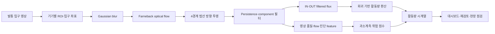
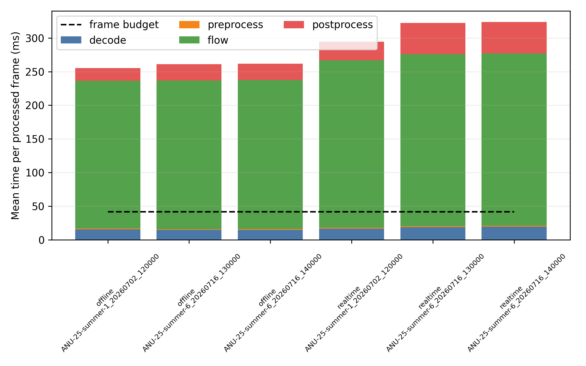
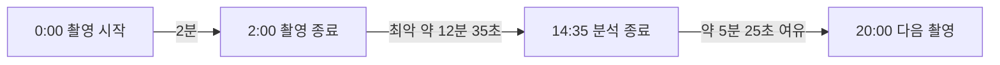

# 영상 기반 벌통 활동·신뢰도 모니터링 시스템

## 프로젝트 의의, 벤치마크, 현재 도달 수준 및 향후 과제

**보고서 기준일:** 2026-09-06  
**대상 독자:** 프로젝트를 처음 접하는 연구자, 개발자, 의사결정자  
**분석 대상:** 현재 작업공간의 구현 코드, 검증 데이터, 오차 분석, 위험 모델 및 Raspberry Pi 벤치마크

> **핵심 판단**  
> 이 프로젝트는 아직 모든 상황에서 정확한 벌 마릿수를 산출하는 완성형 자동 계수기는 아니다. 그러나 벌통 입구 영상에서 방향별 활동량을 수치화하고, 그 수치가 크게 과소계측될 위험까지 별도로 표시하는 **후향적으로 검증된 연구용 모니터링 프로토타입**에는 도달했다. 현재 Raspberry Pi에서 24 FPS 연속 실시간 처리는 불가능하지만, **20분마다 2분을 촬영하고 다음 촬영 전까지 분석하는 주기적 배치 운용은 실내 비스로틀링 조건에서 계산상 가능**하다.

---

## 1. 이 프로젝트가 해결하려는 문제

벌통 입구에서는 벌이 빠르게 움직이고, 서로 겹치며, 몸의 일부만 보이거나 날개·그림자·입구 구조물에 의해 형상이 크게 달라진다. 개체 탐지와 ID 추적만으로 모든 출입을 안정적으로 세기 어려운 이유다. 이 프로젝트는 문제를 다음과 같이 바꾼다.

> “각 벌을 찾아 추적한다”가 아니라 “입구 경계를 어느 방향으로 얼마나 많은 움직임이 통과했는가를 측정한다.”

OpenCV의 dense Farneback optical flow를 이용해 입구 사각형의 상·하·좌·우 네 경계 주변 움직임을 계산하고, 경계 법선 방향 성분의 부호에 따라 `IN`과 `OUT` flux를 분리한다. 출력은 개체 ID가 아니라 시간 구간별 방향성 활동량이다.



이 구조의 의미는 단순한 카운터보다 넓다. 영상을 사람이 모두 판독하지 않고도 벌통의 일중 활동, 방향별 변화, 벌통 간 상대 차이, 이상 구간 및 측정 불확실성을 시계열 자료로 바꿀 수 있다.

---

## 2. 현재 시스템이 산출할 수 있는 것

현재 구현은 다음 기능을 하나의 재현 가능한 파이프라인으로 연결한다.

1. 영상명에 따른 기기별 ROI와 entrance 좌표 적용
2. 입구 네 경계의 raw/filtered IN·OUT flux 계산
3. Gaussian blur, temporal persistence, component area filtering
4. 프레임·윈도우·영상 단위 CSV와 preview 생성
5. 여러 영상의 batch 처리와 회귀 모델 비교
6. 밝기·선명도·frame difference·flow·방향성 등 795개 feature 추출
7. 실제값과 예측값의 절대·상대·부호 오차 분석
8. 고오차 과소계측 위험을 0~1 점수로 출력하는 품질 모델
9. Raspberry Pi에서 단계별 처리 시간, frame drop, 온도 및 메모리 계측

따라서 현재 결과는 단일 숫자보다 다음과 같은 다층 출력으로 해석하는 편이 적절하다.

```text
유입 활동 지표        38
유출 활동 지표        27
순유입 지표          +11
총 활동 수준          높음
고오차 과소계측 위험   0.62
품질 판정             재검토 권장
```

여기서 `IN`과 `OUT`의 회귀 환산값은 calibration된 추정치이며, 모든 환경에서 실제 마릿수와 동일한 확정값은 아니다. 특히 낮은 실제 활동량에서는 양의 회귀 절편이 상대오차를 크게 확대한다.

---

## 3. 벤치마크 결과

### 3.1 Flux와 실제 카운트의 관계

> **비교 주의:** 아래 초기·확대·현재 수치는 표본과 참값 0 처리 규칙이 서로 다르다. 시간에 따른 성능 향상·하락으로 직접 비교할 수 없으며, 현재 0이 아닌 참값 적합도도 동일 자료에 적합·평가한 내부 수치이지 독립 시험 성능이 아니다.

검증은 단계적으로 확대됐다. 초기 단일 기기 500건에서는 높은 설명력이 관찰됐지만, 기기와 조건을 확대한 3,822건에서는 성능이 낮아졌다. 이는 초기 가능성이 부정된 것이 아니라, 단일 환경에서 얻은 성능이 다양한 현장 조건에 그대로 일반화되지 않음을 보여준다.

| 분석 단계 | 방향 | 분석 표본 | 모델 | R² | MAE | RMSE |
|---|---:|---:|---|---:|---:|---:|
| 초기 단일기기 검증 | IN | 500 | 선형 | 0.842 | 12.00 | 20.18 |
| 초기 단일기기 검증 | OUT | 500 | 선형 | 0.816 | 11.68 | 18.67 |
| 확대 검증·전체행 모델 | IN | 3,822 | 선형 | 0.773 | 13.18 | 22.13 |
| 확대 검증·전체행 모델 | OUT | 3,822 | 선형 | 0.748 | 14.06 | 23.37 |
| 현재 0이 아닌 참값 적합 | IN | 2,455 | 선형 | 0.718 | 17.38 | 26.61 |
| 현재 0이 아닌 참값 적합 | OUT | 2,442 | 선형 | 0.691 | 18.87 | 28.22 |

**해석 시 주의:** 세 단계는 표본 구성과 적합 규칙이 다르므로 엄밀한 동일 조건 성능 비교가 아니다. 특히 현재 모델은 참값이 0인 행을 적합에서 제외하여 더 어려운 활동 구간의 관계를 평가한다. 현재 nonzero subset에서 flat-exponential 모델은 선형 모델보다 R²와 RMSE가 극미세하게 좋았지만 MAE는 오히려 약간 나빴다. 현 자료만으로 의미 있는 비선형 우위를 주장하기 어렵다.

현재 결과가 지지하는 주장은 “filtered flux가 활동량과 유의미하게 연동된다”는 것이다. 반면 “어떤 기기와 시간대에서도 개별 영상의 실제 마릿수를 정밀하게 맞춘다”는 주장은 지지하지 않는다.

### 3.2 낮은 실제 활동량에서의 실패 형태

참값이 0이 아닌 2,522개 영상의 총 상대절대오차 분포는 다음과 같았다.

| 지표 | 결과 |
|---|---:|
| 상대절대오차 25백분위 | 18.1% |
| 중앙값 | 42.8% |
| 75백분위 | 144.1% |
| 90백분위 | 855.3% |
| 매우 높은 오차 구간 비율 | 282/2,522, 11.2% |

매우 높은 오차 구간의 96.1%는 실제값이 1~3인 영상이었고, 이 구간은 모두 과대계측이었다. 실제값 중앙값은 2였지만 예측 중앙값은 28이었다. 주된 원인은 영상 품질보다 낮은 활동량과 양의 회귀 절편이다.


이 결과는 시스템의 제품 정의에 직접 영향을 준다. 저활동 구간에서 회귀 환산값을 그대로 “벌 마릿수”로 제시하기보다, 무활동/저활동/활동 상태를 먼저 분리하는 two-part 또는 hurdle model과 신뢰도 표시가 필요하다.

### 3.3 활동량이 충분한 구간의 정확도

총 실제값이 50 이상인 1,384개 영상만 분석하면 상대오차는 훨씬 현실적인 범위로 내려간다.

| 지표 | 결과 |
|---|---:|
| 절대 상대오차 중앙값 | 23.7% |
| 절대 상대오차 90백분위 | 69.8% |
| 과소계측 비율 | 820/1,384, 59.2% |
| 과대계측 비율 | 564/1,384, 40.8% |
| 고오차 과소계측 | 142/1,384, 10.3% |
| 고오차 과대계측 | 89/1,384, 6.4% |

고오차 과소계측 142건의 실제값 중앙값은 136, 예측 중앙값은 30.3, 상대오차 중앙값은 71.3%였다. 이 영상들은 저오차 과소계측 영상보다 대체로 어둡고, 명암·선명도·프레임 변화량과 flow 후보의 수·면적 변동이 작았다. 즉 과소계측은 무작위 오류만이 아니라 관측 가능한 영상·flow 상태와 연관된다.

### 3.4 고오차 과소계측 위험 모델

위 1,384개, 즉 참값 총출입이 50 이상인 영상만 대상으로 실제값보다 56.2%를 초과해 낮게 예측한 경우를 양성으로 정의했다. 56.2%는 양봉학적 허용 기준이 아니라 이 자료의 오차 분포에서 유도된 경계다. 날짜가 학습과 검증에 동시에 섞이지 않도록 날짜 그룹 5-fold 교차검증을 사용했다.

| 모델 입력 | 날짜 그룹 ROC AUC | Average precision |
|---|---:|---:|
| 장치 번호만 | 0.896 | 0.373 |
| 영상 품질만 | 0.974 | 0.834 |
| 영상 품질 + flow 진단 | **0.984** | **0.854** |
| 영상 품질 + flow + 장치 번호 | 0.987 | 0.886 |

장치 번호를 포함한 모델이 내부 성능은 가장 높았지만, 장치별 고오차 빈도를 직접 학습할 위험이 있다. 최종 권장 모델은 장치 번호를 제외한 `quality_flow`다.

`quality_flow`의 날짜 그룹 교차검증 결과는 다음과 같다.

- ROC AUC 0.984, 날짜 bootstrap 95% CI 0.976~0.990
- Average precision 0.854, 95% CI 0.763~0.912
- 양성 기준율 10.3%
- 임계값 0.444
- 정밀도 75.2%, 재현율 81.0%, 특이도 96.9%, F1 0.780
- 전체 영상의 11.1%를 위험 구간으로 표시


시간 순서상 마지막 20% 날짜를 완전히 보류한 검증에서도 ROC AUC 0.971, AP 0.918이었다. 반면 장치 하나 전체를 학습에서 제외하는 leave-one-device-out 검증은 ROC AUC 0.835, AP 0.420으로 낮아졌다. 현재 위험 모델은 **기존 장치군의 미래 날짜에는 강하지만, 보지 못한 새 카메라에 즉시 일반화되는 모델은 아니다.**

이 모델의 올바른 용도는 자동 count 보정이 아니라 재검토·재처리 우선순위를 정하는 품질 경보다. 현장에서는 참값 50 이상 여부를 미리 알 수 없으므로, 위 성능을 전체 영상 스트림의 경보 성능으로 확대할 수 없다. 관측 가능한 activity proxy로 적용 대상을 정하고 전체 스트림에서 전향 검증해야 한다.

### 3.5 Raspberry Pi 처리량 벤치마크

실제 배포 후보 장치에서 24 FPS 실시간 처리 가능성을 별도로 측정했다.

- Raspberry Pi, ARM Cortex-A72 4 core, 최대 1.8 GHz, 메모리 약 2 GB
- 1640×1232, H.264, 24 FPS, 120초 영상 3개
- 실제 분석 ROI 1180×260, 306,800 pixel
- 영상별 초·중·후반 600 frame 구간
- offline/realtime 각 9회, 총 18개 구간
- warm-up 제외 후 총 5,291개 처리 frame pair

| 모드 | 처리율 | End-to-end p95 | Deadline miss | Frame drop | 판정 |
|---|---:|---:|---:|---:|---|
| Offline | 3.853 FPS | 270.64 ms | 100% | 0% | 24 FPS 실시간 실패 |
| Realtime 모사 | 3.398 FPS | 381.29 ms | 100% | 85.69% | 24 FPS 실시간 실패 |

24 FPS의 frame budget은 41.67 ms다. Offline 평균 throughput은 요구량의 16.1%이며 약 6.23배 가속이 필요하다. 평균 처리 시간 259.46 ms 중 Farneback 계산이 220.36 ms, 84.93%를 차지했다. H.264 decode를 완전히 제거해도 현 알고리즘은 실시간 기준을 만족할 수 없다.



그러나 목표를 연속 24 FPS가 아니라 **20분마다 2분 촬영하는 배치 운용**으로 정의하면 결론이 달라진다.



| 주기 구성 | 측정 기반 예상 |
|---|---:|
| 촬영 | 2분 |
| 분석 | 평균 12분 27초, 최악 약 12분 35초 |
| 다음 촬영까지 여유 | 최악 기준 약 5분 25초 |
| 하루 촬영 횟수 | 최대 72회 |
| 원본 영상 발생량 | 약 3.2~10.8 GB/일 |

실내 시험의 최대 SoC 온도는 44.3°C였고 1.8 GHz가 유지되어 열에 의한 성능 저하 증거는 관찰되지 않았다. 다만 야외 밀폐 함체와 직사광 조건은 시험하지 않았다. 이 운용은 20분 중 2분만 보는 10% duty-cycle 표본이므로 하루 전체 출입 총계로 보거나 나머지 18분에 단순 외삽하면 안 된다. 실제 현장 판정 기준은 모든 반복 주기에서 분석시간 18분 미만, backlog 0, thermal/undervoltage throttling 0으로 두는 것이 타당하다.

---

## 4. 현재 도달 수준

### 4.1 성숙도 판단

| 구성 요소 | 현재 수준 | 근거 | 남은 불확실성 |
|---|---|---|---|
| 방향성 활동 측정 | 구현 완료 | 4경계 IN/OUT flux와 batch 산출물 | 기기별 좌표·방향 검증 |
| 카운트 calibration | 후향적 정량 검증 | 최대 3,822건 회귀 분석 | 저활동 절편, 외부 데이터 일반화 |
| 오류 구조 분석 | 상당 부분 달성 | 상대오차·기기별 원인 분석 | 영상 직접 판독을 통한 인과 확인 |
| 신뢰도 모델 | 내부 개념 검증 완료 | 날짜 CV AUC 0.984 | 새 장치 AP 0.420, device 20 누락 |
| Edge 계산 | 배치 운용 가능성 확인 | 20분 주기 시간 예산 만족 | 야외 열·전원·장기 반복 검증 |
| 24 FPS 실시간 | 미달 | 3.4~3.9 FPS, drop 85.7% | 알고리즘 구조 최적화 필요 |
| 현장 제품 | 초기 단계 | 데이터·뷰어·품질 분석 기반 확보 | 자동 수집·전송·알림·유지보수 |

전체적으로는 **알고리즘 타당성과 후향적 위험 판별을 입증한 연구용 프로토타입**과 **현장 배치 시스템** 사이에 있다. 분석 파이프라인과 실패 양상은 상당히 구체화됐지만, 여러 양봉장과 새 카메라를 대상으로 장기간 무인 운용이 검증된 단계는 아니다.

### 4.2 지금 의미 있게 사용할 수 있는 범위

현재 근거가 비교적 강한 용도는 다음과 같다.

- 저장 영상의 batch 분석
- 시간대별·날짜별 상대 활동 추세 산출
- 동일 장치에서 평소 패턴과 다른 구간 선별
- 고오차 과소계측 위험이 높은 영상을 재검토 대상으로 분류
- 필터·ROI·카메라 조건을 비교하는 연구 플랫폼
- 20분 단위 주기적 촬영·분석 시스템의 파일럿 구축

조건부로 가능한 용도는 다음과 같다.

- 벌통 간 활동 비교: 장치별 calibration과 동일 설치 조건 필요
- 자동 이상 알림: 기상·카메라 상태와 함께 해석해야 함
- 절대 마릿수 보고: 충분한 활동 구간과 신뢰도 조건에서만 참고값으로 사용

현재 근거로 지지되지 않는 용도는 다음과 같다.

- 벌통의 전체 개체 수 추정
- 영상만으로 질병·농약 피해·분봉을 확정 진단
- 새 카메라에 calibration 없이 즉시 적용
- Raspberry Pi에서 현재 dense Farneback 설정 그대로 24 FPS 연속 실시간 처리

---

## 5. 학술적·실용적 의의

### 5.1 학술적 의의

첫째, 벌 출입 모니터링을 개체 검출 문제가 아닌 **경계 통과 흐름 측정 문제**로 재정의했다. 이는 겹침과 형상 변화가 심한 생물 영상에서 개체 ID 없이 행동량을 추정하는 대안적 접근이다.

둘째, 단순 activity score에 머무르지 않고 방향별 flux를 실제 카운트와 연결하여 오차의 크기와 부호를 분석했다. 높은 설명력만 제시하지 않고 저활동 과대계측, 고활동 과소계측, 장치별 calibration 실패를 분리했다는 점이 중요하다.

셋째, 영상 품질과 flow 진단 feature로 **관측 신뢰도**를 예측했다. 날짜 그룹 검증과 시간 순서 검증에서는 높은 판별력을 보였으며, leave-one-device-out 성능 하락까지 제시해 일반화 경계를 명확히 했다.

넷째, 알고리즘 정확도뿐 아니라 Raspberry Pi에서의 latency, frame drop, 병목, 온도, 저장량과 주기 시간 예산을 함께 평가했다. 연구 결과를 실제 운용 형태로 연결하기 위한 시스템 수준 근거다.

### 5.2 실용적 의의

실제 제품으로 발전하면 원본 영상을 모두 사람이 확인하지 않고 다음 정보만 전송할 수 있다.

- 방향별 활동량과 상대 변화
- 저활동·정상활동·고활동 상태
- 고오차 과소계측 위험 점수
- 카메라·영상 품질 경고
- 검토가 필요한 짧은 영상 목록

이는 데이터 전송과 판독 부담을 낮추고, 여러 벌통 중 먼저 확인해야 할 대상을 정하는 도구가 될 수 있다. 정확한 진단을 대신하기보다 **현장 관찰과 내검의 우선순위를 정하는 조기 경보 계층**으로서 가장 현실적인 가치가 있다.

---

## 6. 앞으로 해낼 과제

### 과제 1. 저활동 구간의 모델을 분리한다

현재 가장 명확한 실패는 실제값 1~3 구간에서 양의 절편 때문에 발생하는 과대계측이다. 다음을 비교해야 한다.

- 무활동/저활동을 먼저 판별한 뒤 양수 구간만 회귀하는 hurdle model
- zero-inflated 또는 count distribution 모델
- 활동량 구간별 calibration
- 절편 0 고정 회귀와 제한된 양의 절편

평가 지표도 전체 R² 하나가 아니라 저활동 false positive, 활동 구간 MAPE/MAE, 방향별 bias로 분리해야 한다.

### 과제 2. 새 장치 일반화를 높인다

위험 모델의 날짜 검증 AUC는 0.984지만 leave-one-device-out AP는 0.420이다. 새 카메라·새 벌통별로 다음 절차가 필요하다.

- 설치 직후 층화된 수작업 라벨 영상 확보
- 장치별 ROI와 IN/OUT 방향 검증
- 장치별 calibration 또는 계층적 모델
- leave-one-hive/site/device-out 평가
- 소량 라벨을 이용한 probability recalibration

### 과제 3. 신뢰도 모델을 현장 출력으로 통합한다

현재 위험 점수는 분석 산출물로 존재한다. 운영 시스템에서는 다음 정책이 필요하다.

- 위험 점수 0.444 이상 시 count를 확정값이 아닌 주의값으로 표시
- 고위험 영상 자동 보존 및 재처리
- 장치별 threshold와 calibration 상태 표시
- 위험 사유를 밝기·선명도·frame difference·flow retention으로 요약
- 미검출 비용과 오경보 비용에 따른 임계값 조정

### 과제 4. 속도와 정확도의 Pareto curve를 만든다

24 FPS 처리를 위해 단순 코드 정리보다 optical-flow 연산 자체를 줄여야 한다.

1. ROI downsampling 비율별 처리속도와 count 정확도 비교
2. 전체 ROI가 아닌 entrance boundary strip만 계산
3. Farneback pyramid level·iteration·window grid 탐색
4. sparse Lucas–Kanade 또는 block/gradient flux 비교
5. Picamera2 low-resolution stream 직접 입력
6. 후보별 latency와 기존 출력 동등성을 함께 검증

목표는 평균 24 FPS가 아니라 p95 ≤ 41.67 ms, drop 0%이며, 배포 여유를 포함하면 p95 ≤ 33.33 ms다.

### 과제 5. 야외 장기 운용을 검증한다

- 가장 더운 시간대의 실제 함체 3시간 이상 반복 시험
- SoC·함체 내부·외기 온도, CPU frequency, 저전압 이력 기록
- 모든 주기 분석시간 18분 미만, backlog 0 확인
- 원본 영상 순환 삭제·선택 보존·전송 정책
- 렌즈 오염·거미줄·비·바람·그림자·야간 조명 대응
- 전원 장애와 네트워크 단절 시 복구 시험

### 과제 6. 생물학적으로 유효한 성과지표를 확립한다

알고리즘의 오차 감소만으로 현장 가치가 자동 입증되지는 않는다. 양봉 전문가와 함께 다음 질문을 검증해야 한다.

- 일중 활동 곡선이 수작업 관찰과 얼마나 일치하는가
- 급격한 활동 변화가 어떤 현장 사건과 연결되는가
- 방향 비대칭이 언제 생물학적 신호이고 언제 입구 주변 반복 움직임인가
- 어떤 시간 집계 단위가 관리 의사결정에 가장 유용한가
- 경보가 실제 내검 우선순위를 개선하는가

---

## 7. 결론

이 프로젝트의 현재 가치는 “정확한 자동 벌 계수기를 완성했다”는 데 있지 않다. 더 중요한 성과는 다음 세 가지다.

1. 벌통 입구의 방향별 움직임을 반복 가능한 activity signal로 변환했다.
2. 낮은 활동량, 특정 장치 및 낮은 영상 품질에서 발생하는 실패 구조를 정량화했다.
3. count와 함께 과소계측 위험을 제공하는 신뢰도 모니터링 계층의 가능성을 입증했다.

현재 시스템은 저장 영상 및 주기적 배치 운용에서 연구와 파일럿에 사용할 수 있는 수준이다. 절대 마릿수 계수와 새 장치 일반화에는 추가 검증이 필요하고, 연속 24 FPS 실시간 배포에는 구조적 최적화가 필요하다. 다음 단계의 성공 기준은 더 높은 단일 R²가 아니라 **저활동 오경보 감소, 새 장치 일반화, 신뢰도 calibration, 야외 무중단 운용 및 양봉 의사결정에 대한 실제 효용**이다.

---

## 8. 근거 자료

- [프로젝트 README](../README.md)
- [현재 회귀 모델 비교](../validation/output/regression_model_comparison.csv)
- [참값 0 제외 상대오차 분석](../analysis/nonzero_relative_error/output/analysis_report.md)
- [참값 50 이상 방향별 오차 분석](../analysis/relative_error_actual50/output/analysis_report.md)
- [고오차 과소계측 위험 모델](../analysis/underprediction_risk_model/output/analysis_report.md)
- [장치 16·20 과대계측 원인 분석](../analysis/device16_20_overprediction/output/analysis_report.md)
- [Raspberry Pi 논문형 벤치마크 분석](../benchmark_results/paper_20260906/paper_analysis_ko.md)
- [Raspberry Pi 원시 pooled 요약](../benchmark_results/paper_20260906/pooled_summary.csv)

**자료 범위 주의:** 최신 회귀와 상대오차·신뢰도·장치별 분석은 현재 작업트리의 미커밋 예비 산출물이다. 논문 제출이나 외부 배포 전에는 분석 코드·입력 데이터·모델 버전·Git commit을 고정하고 동일 환경에서 전체 결과를 재생성해야 한다.
